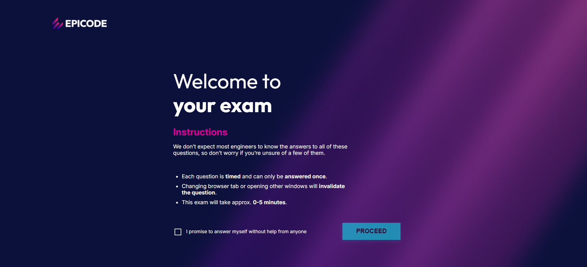
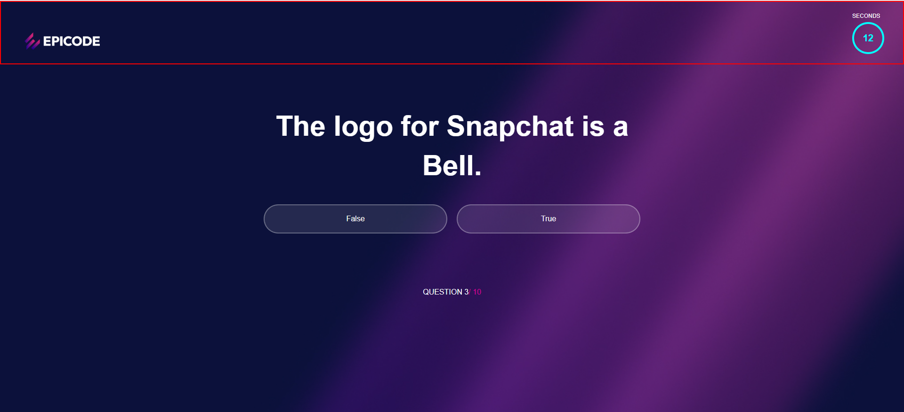
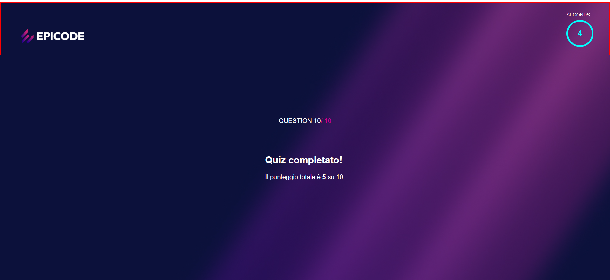

# 📑 QuizPadge

Una mini-app **Quiz** realizzata con **HTML**, **CSS** e **JavaScript**.  
Include una **pagina di benvenuto** e una **pagina quiz** con la logica su file JS separato. Stili organizzati in due CSS dedicati.

## Stack & Badge


## Cosa fa
- **Welcome page** (`welcom.html`) per introdurre il quiz (es. titolo, pulsante “Start”).  
- **Pagina Quiz** (`quiz.html`) con markup dedicato alle domande/risposte.  
- **Logica separata** in `script.js` per gestire l’interazione.  
- **Stili modulari**: `welcom.css` per la welcome, `quiz.css` per il quiz.  
- **Folder `assets/`** per immagini/icone di supporto.

> Nota: i contenuti/feature del quiz (punteggio, feedback, timer, ecc.) dipendono dalla logica in `script.js`. Il progetto è pensato per essere semplice da estendere.

## Come eseguirlo in locale
1. Clona la repo:
   ```
   git clone https://github.com/Alina-Galben/QuizPadge.git
   cd QuizPadge
   ```
2. Apri welcom.html oppure quiz.html nel browser.
- Consigliato: usa l’estensione Live Server di VS Code per auto-refresh.

<p align="center">
  
  
  
</p>

## Note
Solo a scopo didattico: marchi e stile ispirati a Epicode appartengono ai rispettivi proprietari.  
Nessun contenuto protetto incluso.
   
